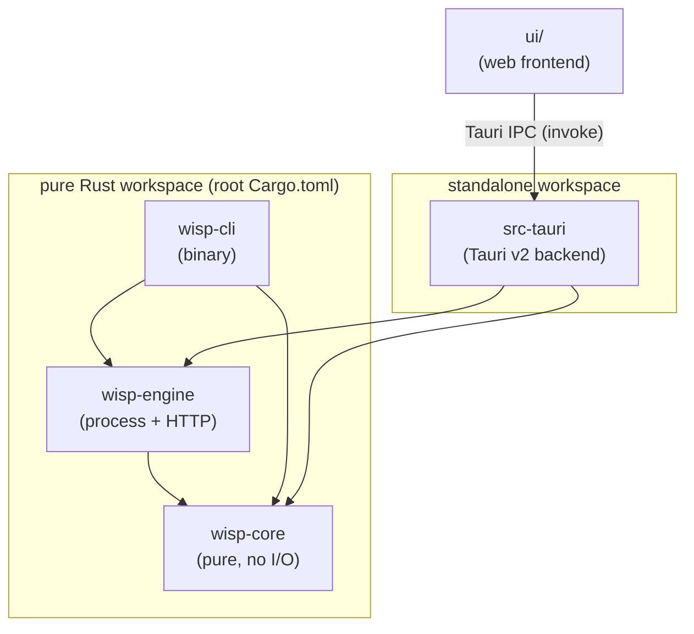

# Architecture Overview

#architecture

Wisp is a Windows VPN/proxy client (Rust + Tauri v2) for VLESS+REALITY(+XHTTP), VLESS+Vision,
and Hysteria2 servers, built by **wrapping** [[Glossary#sing-box|sing-box]] rather than
reimplementing its protocols. See [[Home]] for the top-level map.

## Crate graph

- **`wisp-core`** ([[Crate - wisp-core]]) — the data model (`Profile`, `SplitConfig`) and the
  pure function `build_config()` that turns them into a complete sing-box JSON config. No
  file I/O, no process spawning, no network. 26 unit tests, runs on any OS.
- **`wisp-engine`** ([[Crate - wisp-engine]]) — the only crate that touches the filesystem,
  spawns processes, or makes HTTP calls. Defines the `Engine` trait and its only current
  implementation, `SingBoxProcess`, which runs `sing-box.exe` as a child process and talks to
  its [[Glossary#Clash API|Clash API]].
- **`wisp-cli`** ([[Crate - wisp-cli]]) — a small binary wiring `wisp-core` + `wisp-engine`
  together for terminal use, useful for testing without the GUI.
- **`src-tauri`** ([[Tauri Backend]]) — the Tauri v2 desktop app: holds `AppState`, exposes
  `#[tauri::command]`s to the web UI, persists profiles/settings/split config, manages the
  system tray, and requests Windows admin elevation.
- **`ui/`** ([[Web UI]]) — a vanilla HTML/CSS/JS single page that calls into `src-tauri` via
  `window.__TAURI__.core.invoke(...)`.

Notice the workspace split: `wisp-core`, `wisp-engine`, `wisp-cli` are members of the root
`Cargo.toml` workspace (pure Rust, buildable on Linux/macOS/CI), while `src-tauri` is its own
standalone `Cargo.toml` with `[workspace]` and is `exclude`d from the root workspace, because it
needs a Windows webview toolchain to build. Details in [[Building and Running]].

## Why wrap sing-box instead of reimplementing?

REALITY, XHTTP, and Hysteria2 are protocols with **no mature Rust implementation** — they live
in the Go ecosystem (sing-box, Xray). REALITY in particular is security-critical: it does
active TLS fingerprint mimicry and depends on subtle handshake behavior. Reimplementing any of
this in Rust would be a months-long, security-sensitive undertaking with a high chance of
subtle bugs that leak the user's traffic pattern or break connectivity against actively-probing
censors.

Wisp's answer: don't. Bundle the audited, actively-maintained `sing-box.exe` binary
([[Glossary#sing-box|sing-box]]) and spend Wisp's own engineering effort on the UX that
existing sing-box GUIs don't provide well:

1. **Per-app/per-domain [[Split Tunneling|split tunneling]]** with a friendly UI instead of
   hand-edited `route.rules` JSON.
2. **Automatic MTU** handling (baked into the generated config, no manual `netsh`/`ip link`).
3. A clean, small Tauri v2 client that can later target Android too.

This is why `wisp-core::build_config` produces a config that is *mostly* the user's own
outbound JSON, verbatim — see [[sing-box Config Model]].

## The `Engine` trait as the Android seam

`wisp-engine::engine::Engine` (see [[Engine Trait & Android Port]] and
[[Crate - wisp-engine]]) is an `async_trait` with `start`/`stop`/`status`/`stats`/`logs`/`switch`.
Today it has exactly one implementation, `SingBoxProcess`, which spawns the desktop `.exe`. The
trait boundary exists so that a future Android build can swap in a different `Engine`
implementation — e.g. one backed by an embedded `libsing-box` via `gomobile` — without changing
`wisp-core`, the Tauri command layer's call shape, or the UI's `invoke()` contract.

## Where to go next

- Read the pure core first: [[Crate - wisp-core]].
- Then the process/HTTP layer: [[Crate - wisp-engine]].
- Then how they're stitched into a desktop app: [[Tauri Backend]] and [[Web UI]].
- For hands-on exploration without Windows: [[Crate - wisp-cli]] and [[Building and Running]].
- Domain concepts referenced throughout: [[sing-box Config Model]], [[Split Tunneling]],
  [[Glossary]].
