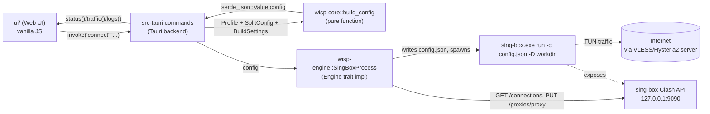

# Wisp Developer Vault

#moc

Wisp is a Windows VPN/proxy client (Rust + Tauri v2, with a future Android target) for
**VLESS+REALITY(+XHTTP)**, **VLESS+Vision**, and **Hysteria2** servers. Rather than
reimplementing these protocols, it wraps the [[Glossary#sing-box|sing-box]] engine and adds
the things a raw sing-box config doesn't give you for free: a friendly UI, **per-app/per-domain
split tunneling**, and **automatic MTU** handling (default 1280). See
[[Architecture Overview]] for the "why wrap, don't reimplement" reasoning.

This vault is for a contributor who knows Rust but has never touched this project, sing-box,
or REALITY/Hysteria2 before. Start at the top of the map below and follow the links.

## Quickstart

- New to the repo? Read [[Architecture Overview]] first, then [[Building and Running]].
- Want to see it work without Windows or a GUI? Use [[Crate - wisp-cli]].
- Confused by a term? Check [[Glossary]].
- Want to add a server type sing-box already supports (e.g. Shadowsocks/VMess UI support, a
  new transport)? Go straight to [[Adding a Protocol or Transport]].

## Data flow (30-second overview)



Full walkthrough: [[Home#Data flow (30-second overview)]] above is the summary; see
[[Architecture Overview]] for crate responsibilities, [[Tauri Backend]] for the command list,
and [[sing-box Config Model]] for what actually ends up in `config.json`.

## Map of Content

### Start here
- [[Architecture Overview]] — crate graph, the "wrap sing-box" decision, the `Engine` seam.
- [[Building and Running]] — dev setup, `cargo test`, fetching resources, Windows build.
- [[Contributing]] — conventions, tests, PR expectations, security notes.

### Core crates
- [[Crate - wisp-core]] — pure data model + sing-box config generation.
- [[Crate - wisp-engine]] — runs and controls the sing-box process.
- [[Crate - wisp-cli]] — headless CLI for testing core+engine.

### Desktop app
- [[Tauri Backend]] — `AppState`, the 17 commands, persistence, tray, elevation.
- [[Web UI]] — the single-page frontend and its `invoke()` calls.

### Domain concepts
- [[sing-box Config Model]] — annotated walkthrough of a generated config.
- [[Split Tunneling]] — `SplitMode`/`SplitRule` and how they become `route.rules`.
- [[Engine Trait & Android Port]] — the seam that lets Wisp run on Android later.

### Extending Wisp
- [[Adding a Protocol or Transport]] — practical guide + checklist.

### Reference
- [[Glossary]] — sing-box, REALITY, XHTTP, Vision, Hysteria2, Wintun, TUN, Clash API, MTU,
  split tunneling, selector.

## Repo layout at a glance

```
Wisp/
├── crates/
│   ├── wisp-core/     # [[Crate - wisp-core]] — pure logic, no I/O
│   ├── wisp-engine/   # [[Crate - wisp-engine]] — runs & controls sing-box
│   └── wisp-cli/      # [[Crate - wisp-cli]] — headless test harness
├── src-tauri/         # [[Tauri Backend]] — Tauri v2 desktop backend
├── ui/                # [[Web UI]] — vanilla HTML/CSS/JS frontend
├── resources/         # downloaded sing-box.exe + wintun.dll (gitignored)
├── scripts/           # fetch-resources.sh / .ps1 — see [[Building and Running]]
└── docs/
    ├── ARCHITECTURE.md    # the source doc this vault expands on
    └── dev-vault/         # you are here
```
